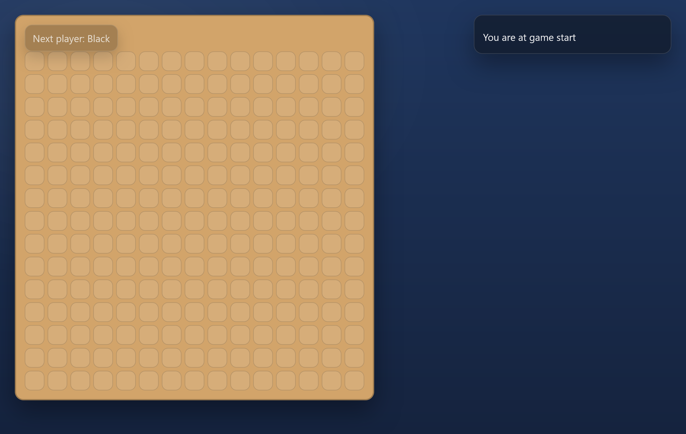
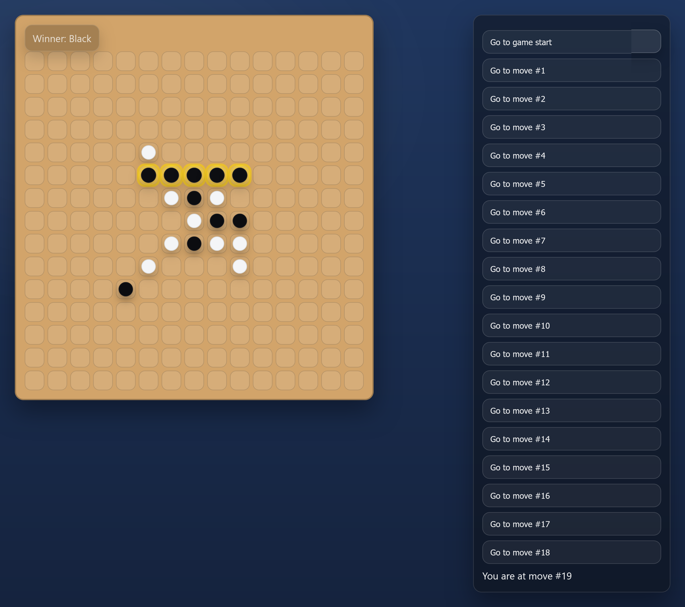
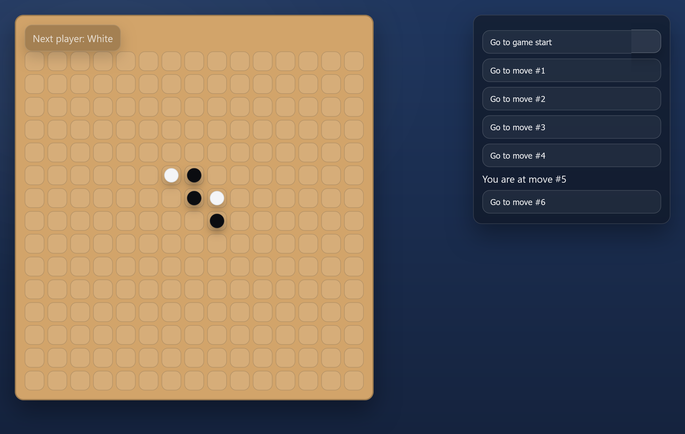

# Gomoku（五目並べ）｜React 学習プロジェクト

React を用いて実装した五目並べ（Gomoku）の Web アプリケーションです。  
フロントエンド開発・状態管理・アルゴリズム設計の学習を目的として制作しました。

---

## 概要

- 15×15 の五目並べゲーム
- 黒・白の石を交互に配置
- 5 個連続で並んだ場合に勝利判定
- 勝利したラインの可視化
- 履歴（時間遡行）機能付き
- シンプルで落ち着いた UI デザイン
- Vercel によるデプロイ対応

---

## デモ・スクリーンショット

🔗 **Vercel デプロイ版**  
https://react-gomoku-pink.vercel.app/

### 盤面


### 勝利時


### 履歴（時間遡行）


---

## 使用技術

- **React**
- **JavaScript (ES6+)**
- **CSS**
- **Node.js / npm**
- **Vercel**

---

## 実装した主な機能

### 1. 五目並べロジック
- 盤面サイズ：15×15
- 横・縦・斜め（両方向）の全パターンを走査
- 明示的で可読性の高い勝利判定アルゴリズムを実装

### 2. 勝利ラインの可視化
- 勝利時に該当する 5 マスをハイライト表示
- UI 表示とゲームロジックを分離した設計

### 3. 履歴（時間遡行）機能
- 各手の盤面状態を履歴として保持
- 過去の手に戻って再度プレイ可能
- 勝利判定は **現在の盤面状態から導出** することで、
  時間遡行後も正しく操作できるよう設計

### 4. UI / UX
- 石はテキストではなく CSS による描画で表現
- 盤面＋ステータスを左カラム、履歴を右カラムに配置
- デフォルトの HTML ボタンスタイルを排除し、統一感のある UI を実装

---

## 設計上の工夫・学び

- **派生状態を state として持たない設計**
  - 勝利状態（winner / winningLine）は盤面から都度計算
  - 履歴移動時のバグを防止
- **責務分離を意識したコンポーネント設計**
  - Game：履歴・手数管理
  - Board：盤面描画・入力制御
  - Square：1 マスの描画
- **学習目的を重視した実装**
  - 最適化よりも可読性・理解しやすさを優先

---

## ローカルでの実行方法

```bash
npm install
npm start